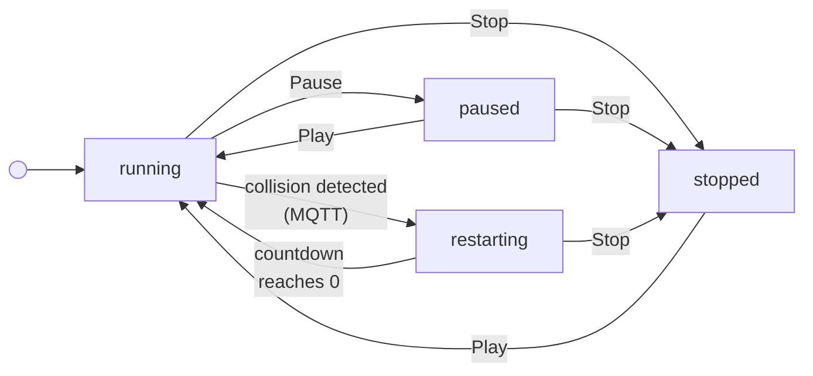

# Pendulum Simulation

A distributed pendulum simulation where each pendulum runs as an independent Node.js process, communicating via MQTT pub/sub. Five pendulums are mounted along a horizontal bar, detect collisions with neighbors, and coordinate stop/restart behavior — all visualized in real time through a React UI.

> **TODO:** Currently a single pendulum is spawned per `POST /init` (shutting down any previous instance). Needs to be extended to spawn five simultaneous instances with different anchor positions.

## Quick Start

```bash
npm install
npm run build
npm start
```

This single command starts the MQTT broker, backend server, and frontend — all in parallel.

For development with hot reload:

```bash
npm run dev
```

Open [http://localhost:5173](http://localhost:5173) (dev) or [http://localhost:4173](http://localhost:4173) (preview) in your browser.

## Architecture

```
┌──────────────────────────────────────────────────────────┐
│                  React UI (frontend)                     │
│         Konva canvas · Simulation controls (TODO)        │
│         Subscribes to MQTT over WebSocket                │
└────────────┬─────────────────────────┬───────────────────┘
             │ REST (init/config)      │ MQTT (ws://localhost:3000/mqtt)
             ▼                         │
┌────────────────────────┐             │
│  Express Server :3000  │             │
│  Orchestrator          │             │
│  fork() per pendulum   │             │
└────────────┬───────────┘             │
             │ child_process.fork()    │
             ▼                         ▼
┌──────────────────────────────────────────────────────────┐
│                MQTT Broker (aedes-cli)                   │
│                TCP :1883 · WS :3001                      │
└──────┬───────┬───────┬───────┬───────┬───────────────────┘
       ▼       ▼       ▼       ▼       ▼
     [P1]    [P2]    [P3]    [P4]    [P5]
     Each: independent Node.js process (fork)
     Each: runs its own physics loop @ ~67Hz
     Each: publishes position to pendulum/{id}/position
```

### How It Works

1. The **Express server** (orchestrator) receives configuration via `POST /init` and spawns each pendulum as a separate Node.js child process using `child_process.fork()`.
2. Each **pendulum process** connects to the MQTT broker, runs its own physics simulation loop, and publishes its bob position to `pendulum/{id}/position` every 15ms.
3. The **React frontend** connects directly to the MQTT broker over WebSocket and subscribes to each pendulum's position topic via `@artcom/mqtt-topping-react`. No position data flows through the Express server — the frontend reads from MQTT in real time.
4. Rendering uses **Konva** (`react-konva`) for declarative 2D canvas drawing — pivot points, arm, and bobs are React components that re-render on each MQTT message.

### Key Design Decisions

**Separate Node.js processes via `fork()`.** The spec evaluates "distributed systems coordination," so each pendulum runs as a genuinely independent OS process. Inter-instance communication goes through the MQTT broker, not shared memory or function calls. The orchestrator manages lifecycle (spawn, shutdown) via IPC messages.

- _Alternative: multiple pendulums in a single process_ — simpler, but wouldn't exercise inter-process communication or distributed coordination, which is what the assignment is evaluating.
- _Alternative: five static processes started beforehand_ — would work, but wouldn't allow a dynamic number of pendulums. Using `fork()` from the orchestrator makes the system configurable at runtime.

**MQTT via aedes-cli for inter-instance communication.** The STOP/RESTART broadcast pattern maps naturally to pub/sub topics. Each pendulum publishes its position, and collision detection subscribes to neighbor topics. STOP and RESTART are broadcast to all instances via shared topics. Using `aedes-cli` as a standalone broker (rather than embedding aedes in the server) keeps concerns cleanly separated — the broker is infrastructure, not application logic.

- _Alternative: HTTP polling between instances_ — high overhead per tick, poor fit for real-time simulation data at ~67Hz. Pub/sub decouples producers from consumers and scales better as the number of pendulums grows.

**Frontend subscribes to MQTT directly.** Rather than routing position data through the Express backend (adding latency and coupling), the React app connects to the MQTT broker over WebSocket. The Express server is only used for orchestration (init, config). This separation means the UI updates at the same frequency as the simulation with no intermediary.

- _Alternative: frontend polls Express for positions_ — adds a round-trip through the backend on every frame, increasing latency and server load. Direct MQTT subscription eliminates that hop entirely.

**Konva for rendering.** `react-konva` provides a declarative React API over HTML5 Canvas, combining the performance of canvas rendering with the component model React developers expect. Each pendulum is a self-contained React component that manages its own MQTT subscription.

**UUIDv7 for instance IDs.** Pendulum IDs are time-sortable UUIDs, which makes debugging and log correlation straightforward across distributed processes.

- _Alternatives: UUIDv4 or incremental integers_ — both would work. UUIDv7 was chosen as a modern standard; the time-sortable property is a minor convenience for log reading but has no architectural impact here.

## Project Structure

```
pendulum-simulation/
├── backend/
│   ├── src/
│   │   ├── server.ts           # Express server entry point
│   │   ├── app.ts              # App instance
│   │   ├── createApp.ts        # Express app factory (routes, fork logic)
│   │   ├── pendulumProc.ts     # Child process entry — connects MQTT, runs simulation
│   │   ├── pendulum.ts         # Pendulum class — physics engine
│   │   ├── pendulumFactory.ts  # Factory for creating Pendulum instances
│   │   └── MqttClient.ts       # MQTT client wrapper (publish position)
│   └── package.json
├── common/
│   └── index.d.ts              # Shared types: Point, DTOs
├── frontend/
│   ├── src/
│   │   ├── App.tsx             # Root component, MqttProvider
│   │   ├── ResponsiveStage.tsx # Konva stage, handles window resize
│   │   └── Pendulum.tsx        # Single pendulum — subscribes to MQTT, renders
│   └── package.json
├── package.json                # Root — npm workspaces, orchestrates all services
└── README.md
```

## Physics Model

Each pendulum is simulated using the simple pendulum equation of motion:

```
α = -(g · sin(θ)) / L
```

Where `α` is angular acceleration, `g` is the gravitational constant, `θ` is the current angle from vertical, and `L` is the string length.

The simulation uses **Euler integration** — angular velocity accumulates acceleration each tick, and the angle accumulates velocity:

```
angleVelocity += angleAcceleration
angle += angleVelocity
```

Bob position is derived from the angle:

```
x = L · sin(θ)
y = L · cos(θ)
```

The physics loop runs every **15ms (~67Hz)**, publishing the updated position to MQTT on each tick.

References:

- [The Coding Train — Simple Pendulum Simulation](https://www.youtube.com/watch?v=NBWMtlbbOag)
- [The Nature of Code — Oscillation](https://natureofcode.com/oscillation/#the-pendulum)

### Collision Detection

> **TODO:** Not yet implemented. Each pendulum will subscribe to its neighbors' position topics.

Each pendulum subscribes to its neighbors' position topics. Collisions are detected by computing the Euclidean distance between adjacent bobs. When the distance falls below a configurable threshold, a `STOP` message is broadcast.

### STOP/RESTART Protocol

> **TODO:** Not yet implemented. Depends on collision detection.

1. A pendulum detects a collision and publishes `STOP` to all instances via MQTT
2. All instances halt their simulation loop
3. Each instance publishes `RESTART` to signal readiness
4. Each instance waits until it receives `RESTART` from all other instances
5. After a 5-second delay, all simulations resume

### Wind (Bonus)

> **TODO:** Not yet implemented. Wind will be modeled as a constant horizontal force applied to the angular acceleration:
>
> ```
> const angleAccel = (-1 * GRAVITY * Math.sin(this.angle)) / this.length + (wind / (this.mass * this.length)) * Math.cos(this.angle);
> ```
>
> Requires adding `mass` and `wind` parameters to the `Pendulum` constructor.

## MQTT Topics

| Topic                    | Publisher             | Subscriber                    | Payload                    |
| ------------------------ | --------------------- | ----------------------------- | -------------------------- | -------- |
| `pendulum/{id}/position` | Each pendulum process | Frontend + neighbor pendulums | `{ x: number, y: number }` |
| `simulation/stop`        | Detecting pendulum    | All pendulums                 | —                          | **TODO** |
| `simulation/restart`     | Each pendulum         | All pendulums                 | `{ id: string }`           | **TODO** |

## Configuration

> **TODO:** `mass` and `anchor` parameters not yet supported. Currently only `angle` and `length` are configurable.

Each pendulum accepts the following parameters via the REST API:

| Parameter | Description                             | Unit    |
| --------- | --------------------------------------- | ------- | -------- |
| `angle`   | Initial angle from vertical             | degrees |
| `length`  | String length                           | pixels  |
| `mass`    | Mass of the bob (affects bob radius)    | kg      | **TODO** |
| `anchor`  | Horizontal position on the mounting bar | pixels  | **TODO** |

## UI Controls

The toolbar tracks a `SimulationState` with four values:

| State | Description |
|---|---|
| `running` | Pendulums are actively animating |
| `paused` | Animation is frozen; can be resumed |
| `stopped` | Animation is reset to initial position; pendulum count can be changed |
| `restarting` | A collision was detected; countdown is active before auto-restart |

### State Transitions



### Button Enable/Disable Rules

| Button | `running` | `paused` | `stopped` | `restarting` |
|---|---|---|---|---|
| **− / + (instances)** | disabled | disabled | **enabled** | disabled |
| **Pause** | **enabled** | disabled | disabled | disabled |
| **Stop** | **enabled** | **enabled** | disabled | **enabled** |
| **Play** | disabled | **enabled** | **enabled** | disabled |

### Notes

- Instance count can only be changed in `stopped` state.
- The `restarting` state is driven entirely by the MQTT `pendulum/countdown` topic — it is not triggered by a button.
- Pressing Stop during `restarting` clears the countdown immediately and moves to `stopped`, preventing any auto-transition back to `running`.
- On mount, the frontend calls `play()` to sync the backend to `running`.

## API

### `POST /init`

Initialize a pendulum instance. (**TODO:** Currently spawns a single instance and shuts down any previous ones. Will be extended to initialize all five pendulums at once.)

**Request body:**

```json
{ "angle": 30, "length": 450 }
```

**Response:**

```json
{ "id": "01964c8a-..." }
```

## Testing

```bash
npm test
```

Runs backend unit tests via Vitest. The pendulum physics engine is tested in isolation by passing `null` as the MQTT client (enabled by the factory pattern), so tests run without a broker.

Tests cover:

- Bob moves from initial position after a simulation step
- Bob swings past equilibrium to the opposite side (oscillation behavior)
- Bob stays at rest when initialized at angle 0 (no force applied)

> **TODO:** Add unit tests for REST API endpoints and collision detection logic.

## Debugging

Subscribe to all MQTT messages to observe inter-instance communication:

```bash
npm run mqtt:log
```

This subscribes to `#` (all topics) on the local broker and prints messages in real time — useful for verifying position publishing, collision events, and the STOP/RESTART protocol.

## Tech Stack

| Layer        | Technology                                                  |
| ------------ | ----------------------------------------------------------- |
| Backend      | Node.js, Express, TypeScript                                |
| Frontend     | React, TypeScript, Konva (react-konva), Vite                |
| Messaging    | MQTT (aedes-cli broker, mqtt.js client, mqtt-topping-react) |
| Shared types | npm workspaces (`@pendulum-simulation/common`)              |
| Testing      | Vitest                                                      |
| IDs          | UUIDv7                                                      |

## Future Work

Items outside the scope of this exercise but worth addressing in a production environment:

- **MQTT authentication** — the broker currently accepts unauthenticated connections. In production, client credentials or token-based auth should be enforced to prevent unauthorized publishing.
- **Mobile-responsive UI** — the Konva stage resizes with the browser window but is not optimized for mobile viewports or touch interactions.
