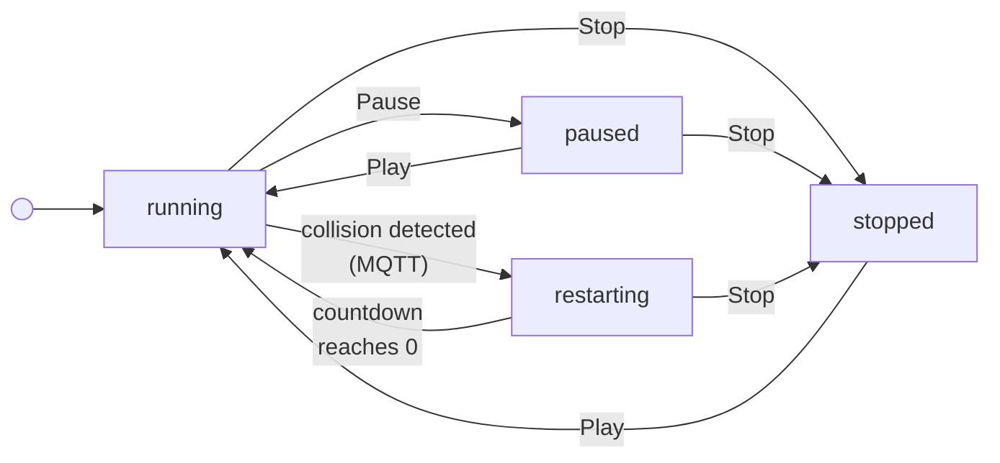

# Pendulum Simulation

A distributed pendulum simulation where each pendulum runs as an independent Node.js process, communicating via MQTT pub/sub. Pendulums are mounted along a horizontal bar, detect collisions with neighbors, and coordinate stop/restart behavior — all visualized in real time through a React UI.

**Live demo:** [https://pendulum.tiagojustino.com](https://pendulum.tiagojustino.com)

## Quick Start

```bash
npm install
npm run build
npm start
```

This single command starts the MQTT broker, backend server, and frontend — all in parallel.

For development with hot reload:

```bash
npm run dev
```

Open [http://localhost:5173](http://localhost:5173) (dev) or [http://localhost:4173](http://localhost:4173) (preview) in your browser.

## Architecture

```
┌──────────────────────────────────────────────────────────┐
│                  React UI (frontend)                     │
│         Konva canvas · Simulation controls               │
│         Subscribes to MQTT over WebSocket                │
└────────────┬─────────────────────────┬───────────────────┘
             │ REST (init/config)      │ MQTT (ws://localhost:3002/mqtt)
             ▼                         │
┌────────────────────────┐             │
│  Express Server :3000  │             │
│  Orchestrator          │             │
│  fork() per pendulum   │             │
└────────────┬───────────┘             │
             │ child_process.fork()    │
             ▼                         ▼
┌──────────────────────────────────────────────────────────┐
│                MQTT Broker (aedes-cli)                   │
│                TCP :1883 · WS :3002                      │
└──────┬───────┬───────┬───────┬───────┬───────────────────┘
       ▼       ▼       ▼       ▼       ▼
     [P1]    [P2]    [P3]    [P4]    [P5]
     Each: independent Node.js process (fork)
     Each: runs its own physics loop @ ~67Hz
     Each: publishes position to pendulum/{id}/position
```

### How It Works

1. The **Express server** (orchestrator) receives configuration via REST and spawns each pendulum as a separate Node.js child process using `child_process.fork()`.
2. Each **pendulum process** connects to the MQTT broker, runs its own physics simulation loop, and publishes its bob position to `pendulum/{id}/position` every 15ms.
3. The **React frontend** connects directly to the MQTT broker over WebSocket and subscribes to each pendulum's position topic via `@artcom/mqtt-topping-react`. No position data flows through the Express server — the frontend reads from MQTT in real time.
4. Rendering uses **Konva** (`react-konva`) for declarative 2D canvas drawing — pivot points, arm, and bobs are React components that re-render on each MQTT message.

### Key Design Decisions

**Separate Node.js processes via `fork()`.** The spec evaluates "distributed systems coordination," so each pendulum runs as a genuinely independent OS process. Inter-instance communication goes through the MQTT broker, not shared memory or function calls. The orchestrator manages lifecycle (spawn, shutdown) via IPC messages.

- _Alternative: multiple pendulums in a single process_ — simpler, but wouldn't exercise inter-process communication or distributed coordination, which is what the assignment is evaluating.
- _Alternative: five static processes started beforehand_ — would work, but wouldn't allow a dynamic number of pendulums. Using `fork()` from the orchestrator makes the system configurable at runtime.

**MQTT via aedes-cli for inter-instance communication.** The STOP/RESTART broadcast pattern maps naturally to pub/sub topics. Each pendulum publishes its position, and collision detection subscribes to neighbor topics. STOP and RESTART are broadcast to all instances via shared topics. Using `aedes-cli` as a standalone broker (rather than embedding aedes in the server) keeps concerns cleanly separated — the broker is infrastructure, not application logic.

- _Alternative: HTTP polling between instances_ — high overhead per tick, poor fit for real-time simulation data at ~67Hz. Pub/sub decouples producers from consumers and scales better as the number of pendulums grows.

**Frontend subscribes to MQTT directly.** Rather than routing position data through the Express backend (adding latency and coupling), the React app connects to the MQTT broker over WebSocket. The Express server is only used for orchestration (init, config). This separation means the UI updates at the same frequency as the simulation with no intermediary.

- _Alternative: frontend polls Express for positions_ — adds a round-trip through the backend on every frame, increasing latency and server load. Direct MQTT subscription eliminates that hop entirely.

**Konva for rendering.** `react-konva` provides a declarative React API over HTML5 Canvas, combining the performance of canvas rendering with the component model React developers expect. Each pendulum is a self-contained React component that manages its own MQTT subscription.

**UUIDv7 for instance IDs.** Pendulum IDs are time-sortable UUIDs, which makes debugging and log correlation straightforward across distributed processes.

- _Alternatives: UUIDv4 or incremental integers_ — both would work. UUIDv7 was chosen as a modern standard; the time-sortable property is a minor convenience for log reading but has no architectural impact here.

## Project Structure

```
pendulum-simulation/
├── backend/
│   ├── src/
│   │   ├── server.ts           # Express server entry point
│   │   ├── createApp.ts        # Express app factory (routes, fork logic)
│   │   ├── pendulumProc.ts     # Child process entry — connects MQTT, runs simulation
│   │   ├── pendulum.ts         # Pendulum class — physics engine
│   │   ├── pendulumFactory.ts  # Factory for creating Pendulum instances
│   │   ├── pendulumManager.ts  # Manages lifecycle of all pendulum processes
│   │   ├── mqttClient.ts       # MQTT client wrapper (publish position)
│   │   ├── validation.ts       # Request input validation
│   │   └── env.d.ts            # Process environment type declarations
│   └── package.json
├── common/
│   └── index.d.ts              # Shared types: Point, DTOs
├── frontend/
│   ├── src/
│   │   ├── App.tsx             # Root component, MqttProvider
│   │   ├── ResponsiveStage.tsx # Konva stage, handles window resize
│   │   ├── Toolbox.tsx         # Simulation control toolbar
│   │   ├── SettingsPanel.tsx   # Gravity and wind controls
│   │   └── hooks/
│   │       └── usePendulum.ts  # API hooks (React Query mutations)
│   └── package.json
├── package.json                # Root — npm workspaces, orchestrates all services
└── README.md
```

## Physics Model

Each pendulum is simulated using the simple pendulum equation of motion:

```
α = -(g · sin(θ)) / L + (w / (m · L)) · cos(θ)
```

Where `α` is angular acceleration, `g` is the gravitational constant, `θ` is the current angle from vertical, `L` is the string length, `w` is the wind force, and `m` is the bob mass.

The simulation uses **Euler integration** — angular velocity accumulates acceleration each tick, and the angle accumulates velocity:

```
angleVelocity += angleAcceleration
angle += angleVelocity
```

Bob position is derived from the angle:

```
x = L · sin(θ)
y = L · cos(θ)
```

The physics loop runs every **15ms (~67Hz)**, publishing the updated position to MQTT on each tick.

References:

- [The Coding Train — Simulating Forces: Gravity and Wind](https://www.youtube.com/watch?v=Uibl0UE4VH8)
- [The Coding Train — Simple Pendulum Simulation](https://www.youtube.com/watch?v=NBWMtlbbOag)
- [The Nature of Code — Force Accumulation](https://natureofcode.com/forces/#force-accumulation)
- [The Nature of Code — Oscillation](https://natureofcode.com/oscillation/#the-pendulum)

### Collision Detection

Each pendulum subscribes to `pendulum/+/position` (MQTT single-level wildcard), receiving position updates from all other pendulums. A collision is detected when the Euclidean distance between two bobs' center coordinates is less than or equal to the sum of their radii — i.e. the circles are touching or overlapping. When a collision is detected, a `STOP` command is broadcast to all instances.

### STOP/RESTART Protocol

1. A pendulum detects a collision and broadcasts `STOP` to all instances via MQTT
2. All instances halt their simulation loop
3. A countdown is published to `pendulum/countdown` and displayed in the UI
4. After the countdown reaches 0, all simulations resume automatically

### Wind and Gravity

Both gravity (`g`) and wind (a constant horizontal force) are configurable at runtime via the Settings panel. Changes are propagated to all active pendulum processes via IPC.

## MQTT Topics

| Topic                 | Publisher             | Subscriber               | Payload                                        |
| --------------------- | --------------------- | ------------------------ | ---------------------------------------------- |
| `pendulum/+/position` | Each pendulum process | All pendulums + frontend | `{ pivotPosition, bobPosition, mass }`         |
| `pendulum/command`    | Any pendulum          | All pendulums            | `{ id: string, command: "STOP" \| "RESTART" }` |
| `pendulum/+/status`   | Each pendulum         | All pendulums            | `{ status: "ACK" }`                            |
| `pendulum/countdown`  | Coordinator pendulum  | Frontend                 | `{ seconds: number }`                          |
| `pendulum/roster`     | Backend server        | All frontends            | `{ pendulums: PendulumListItemDto[] }`         |

## Configuration

Each pendulum accepts the following parameters via the REST API:

| Parameter       | Description                          | Unit    |
| --------------- | ------------------------------------ | ------- |
| `angle`         | Initial angle from vertical          | degrees |
| `length`        | String length                        | pixels  |
| `mass`          | Mass of the bob (affects bob radius) | kg      |
| `pivotPosition` | Pivot point on the canvas            | pixels  |

## UI Controls

The toolbar tracks a `SimulationState` with four values:

| State        | Description                                                           |
| ------------ | --------------------------------------------------------------------- |
| `running`    | Pendulums are actively animating                                      |
| `paused`     | Animation is frozen; can be resumed                                   |
| `stopped`    | Animation is reset to initial position; pendulum count can be changed |
| `restarting` | A collision was detected; countdown is active before auto-restart     |

### State Transitions



### Button Enable/Disable Rules

| Button                  | `running`   | `paused`    | `stopped`                       | `restarting` |
| ----------------------- | ----------- | ----------- | ------------------------------- | ------------ |
| **− (remove instance)** | disabled    | disabled    | enabled (only if instances ≥ 2) | disabled     |
| **+ (add instance)**    | disabled    | disabled    | **enabled**                     | disabled     |
| **Pause**               | **enabled** | disabled    | disabled                        | disabled     |
| **Stop**                | **enabled** | **enabled** | disabled                        | **enabled**  |
| **Play**                | disabled    | **enabled** | **enabled**                     | disabled     |

### Notes

- Instance count can only be changed in `stopped` state.
- The `-` button is additionally disabled when only one instance remains.
- The `restarting` state is driven entirely by the MQTT `pendulum/countdown` topic — it is not triggered by a button.
- Pressing Stop during `restarting` clears the countdown immediately and moves to `stopped`, preventing any auto-transition back to `running`.

## API

### `POST /add-pendulum`

Spawn a new pendulum instance.

**Request body:**

```json
{
  "angle": 30,
  "length": 450,
  "mass": 20,
  "pivotPosition": { "x": 400, "y": 25 }
}
```

**Response:**

```json
{ "id": "01964c8a-..." }
```

### `PUT /pendulum/:id`

Update an existing pendulum's configuration.

### `DELETE /pendulum/:id`

Shut down a specific pendulum instance.

### `DELETE /pendulum`

Shut down all pendulum instances.

### `POST /pause` · `POST /play` · `POST /stop`

Broadcast lifecycle commands to all active pendulum processes.

### `POST /gravity`

Update the gravitational constant for all active pendulums.

```json
{ "gravity": 9.8 }
```

### `POST /wind`

Update the wind force for all active pendulums.

```json
{ "wind": 2.5 }
```

## Testing

```bash
npm test
```

Runs backend unit tests via Vitest.

**`pendulum.test.ts`** — physics engine, tested in isolation with no MQTT client:

- Bob moves from initial position after one step
- Bob swings past equilibrium to the opposite side (oscillation)
- Bob does not move when gravity is 0
- Bob stays at rest when starting at angle 0

**`api.test.ts`** — REST API via Supertest, with `child_process.fork` mocked:

- `POST /add-pendulum` — returns an id on valid input, unique ids for multiple pendulums, 400 on missing or invalid fields
- `DELETE /pendulum/:id` — success for existing and non-existent ids
- `DELETE /pendulum` — shuts all down, succeeds when empty, allows re-creation after bulk delete
- `PUT /pendulum/:id` — success on valid update, no-op on non-existent id, 400 on invalid body
- `POST /gravity` — valid values, boundary values (min 1, max 20), 400 on missing/out-of-range/non-number/Infinity

## Debugging

Subscribe to all MQTT messages to observe inter-instance communication:

```bash
npm run mqtt:log
```

This subscribes to `#` (all topics) on the local broker and prints messages in real time — useful for verifying position publishing, collision events, and the STOP/RESTART protocol.

## Deployment

The project is deployed on [Railway](https://railway.com) as three separate services:

| Service    | Role                                | URL                                                            |
| ---------- | ----------------------------------- | -------------------------------------------------------------- |
| `frontend` | React SPA (static)                  | [pendulum.tiagojustino.com](https://pendulum.tiagojustino.com) |
| `backend`  | Express API + pendulum orchestrator | Internal + public domain                                       |
| `mqtt`     | aedes MQTT broker (TCP + WebSocket) | Internal TCP + public WebSocket domain                         |

### Service wiring

- `backend` connects to `mqtt` via Railway private networking: `mqtt://mqtt.railway.internal:1883`
- `frontend` (browser) connects to `mqtt` via public WebSocket: `wss://<mqtt-domain>/mqtt`
- `frontend` (browser) calls `backend` via public HTTPS

### Environment variables

**backend:**

| Variable      | Description                             |
| ------------- | --------------------------------------- |
| `MQTT_URL`    | MQTT broker URL (private network)       |
| `CORS_ORIGIN` | Comma-separated list of allowed origins |
| `PORT`        | Injected by Railway                     |

**frontend (build-time):**

| Variable            | Description                      |
| ------------------- | -------------------------------- |
| `VITE_API_BASE_URL` | Backend public URL               |
| `VITE_MQTT_WS_URL`  | MQTT broker public WebSocket URL |

**mqtt:**

| Variable | Description                                      |
| -------- | ------------------------------------------------ |
| `PORT`   | Injected by Railway — used as the WebSocket port |

### Monorepo build commands

Since `backend` depends on `@pendulum-simulation/common`, all services build from the repo root (no `rootDirectory` isolation):

| Service    | Build command            | Start command                  |
| ---------- | ------------------------ | ------------------------------ |
| `backend`  | `npm run backend:build`  | `npm run backend:start`        |
| `frontend` | `npm run frontend:build` | _(static, served by Railpack)_ |
| `mqtt`     | _(none)_                 | `npm run mqtt:start`           |

## Tech Stack

| Layer        | Technology                                                  |
| ------------ | ----------------------------------------------------------- |
| Backend      | Node.js, Express, TypeScript                                |
| Frontend     | React, TypeScript, Konva (react-konva), Vite                |
| Messaging    | MQTT (aedes-cli broker, mqtt.js client, mqtt-topping-react) |
| Shared types | npm workspaces (`@pendulum-simulation/common`)              |
| Testing      | Vitest                                                      |
| IDs          | UUIDv7                                                      |
| Deployment   | Railway (3 services)                                        |

## Known Limitations

- **No multi-session support** — all connected frontends share a single global simulation. Any client can add, remove, or control pendulums and those changes are reflected everywhere in real time via `pendulum/roster` and MQTT. There is no concept of isolated sessions or per-user simulation environments.

## Future Work

Items outside the scope of this exercise but worth addressing in a production environment:

- **MQTT authentication** — the broker currently accepts unauthenticated connections. In production, client credentials or token-based auth should be enforced to prevent unauthorized publishing.
- **Mobile-responsive UI** — the Konva stage resizes with the browser window but is not optimized for mobile viewports or touch interactions.
- **Frontend styling and design** — the UI is functional but minimal. Improvements could include a polished visual theme, better typography, styled controls, and smoother animations for state transitions (e.g. collision flash, countdown display).
- **Test coverage** — collision detection and the STOP/RESTART coordination protocol are not yet covered by unit tests. The `POST /wind` endpoint is also missing API tests. The frontend has no tests; the settings panel (gravity and wind controls) is a good candidate for Playwright end-to-end tests.
